# Multi-Role OpenCode Communication Diagrams

This document contains visual diagrams showing how roles communicate in multi-role OpenCode sessions.

## 1. System Architecture Overview


## 2. Communication Flow - User-Mediated Sequence


## 3. Notification Priority System

```mermaid
flowchart LR
    subgraph "Notification Board (notifications.md)"
        direction TB
        URG["🔴 URGENT<br/>Critical bugs<br/>Build failures<br/>Blockers<br/>Production issues"]
        IMP["🟡 IMPORTANT<br/>Features ready for QA<br/>PRs for review<br/>Architectural decisions<br/>Refactoring complete"]
        FYI["🟢 FYI<br/>Task completions<br/>Merged PRs<br/>General updates<br/>Tips & findings"]
    end
    
    subgraph "User-Mediated Workflow"
        USER["User checks<br/>notifications.md<br/>periodically"]
        ASSIGN["User assigns tasks<br/>to relevant roles"]
        DIRECT["User directs role:<br/>'Check notifications<br/>and respond'"]
    end
    
    URG --> USER
    IMP --> USER
    FYI --> USER
    
    USER --> ASSIGN
    USER --> DIRECT
    
    ASSIGN --> ROLE["Role executes<br/>assigned work"]
    DIRECT --> READ["Role reads<br/>notifications.md"]
    
    READ --> ACT["Role takes<br/>appropriate action"]
    ROLE --> POST["Role posts update<br/>to notifications.md"]
    ACT --> POST
    
    POST --> URG & IMP & FYI
    
    style URG fill:#ff6b6b,stroke:#c92a2a,stroke-width:3px,color:#fff
    style IMP fill:#ffd93d,stroke:#f3a712,stroke-width:2px
    style FYI fill:#6bcf7f,stroke:#37b551,stroke-width:2px
    style USER fill:#95e1d3,stroke:#38a3a5,stroke-width:3px
```



## 4. Cross-Role Collaboration Patterns


## 5. File System Structure & Data Flow

```mermaid
graph TB
    ROOT[".standup/ Directory"]
    
    ROOT --> NB["📢 notifications.md<br/>(Central Message Board)"]
    
    ROOT --> ARCH_DIR["📁 architect/"]
    ROOT --> DEV_DIR["📁 developer/"]
    ROOT --> QA_DIR["📁 qa-engineer/"]
    ROOT --> REV_DIR["📁 code-reviewer/"]
    
    ARCH_DIR --> ARCH_LOG["📄 log-2026-02-12.md<br/>(Daily narrative)"]
    ARCH_DIR --> ARCH_TASK["📋 tasks.json<br/>(Task tracking)"]
    ARCH_DIR --> ARCH_SUM["📊 session-summary-*.md"]
    
    DEV_DIR --> DEV_LOG["📄 log-2026-02-12.md"]
    DEV_DIR --> DEV_TASK["📋 tasks.json"]
    DEV_DIR --> DEV_SUM["📊 session-summary-*.md"]
    
    QA_DIR --> QA_LOG["📄 log-2026-02-12.md"]
    QA_DIR --> QA_TASK["📋 tasks.json"]
    QA_DIR --> QA_SUM["📊 session-summary-*.md"]
    
    REV_DIR --> REV_LOG["📄 log-2026-02-12.md"]
    REV_DIR --> REV_TASK["📋 tasks.json"]
    REV_DIR --> REV_SUM["📊 session-summary-*.md"]
    
    USER["👤 User/Facilitator"]
    
    subgraph "User-Mediated Read/Write"
        RW1["User monitors<br/>notifications.md"]
        RW2["User tells roles<br/>to check & respond"]
        RW3["Roles read when<br/>instructed by user"]
        RW4["Roles write<br/>when completing work"]
    end
    
    USER -.->|Monitors| NB
    NB -.-> RW1
    RW1 --> RW2
    RW2 --> RW3
    RW3 -.-> ARCH_LOG & DEV_LOG & QA_LOG & REV_LOG
    RW4 -.->|Posts to| NB
    
    style NB fill:#ff6b6b,stroke:#c92a2a,stroke-width:3px,color:#fff
    style ROOT fill:#4ecdc4,stroke:#0a9396,stroke-width:2px
    style USER fill:#95e1d3,stroke:#38a3a5,stroke-width:3px
```



## 6. Session Lifecycle State Machine


---

## Key Insights

### **Actual Communication Model:**

✅ **User-Mediated** - User acts as the coordinator between roles  
✅ **Passive Sessions** - Roles wait for user input, no autonomous behavior  
✅ **Shared File Board** - `notifications.md` is the central message board  
✅ **Explicit Instructions** - User tells roles when to check notifications  
✅ **Transparent** - All communication is logged in plain text  
✅ **Git-Friendly** - Entire communication history is version controlled  

### **How It Actually Works:**

1. **File-Based Message Board** - `notifications.md` acts as a shared bulletin board
2. **User Coordination** - User monitors notifications and directs roles
3. **Priority System** - 🔴 URGENT, 🟡 IMPORTANT, 🟢 FYI help user prioritize
4. **Structured State** - Each role maintains `tasks.json` and daily logs
5. **Tmux Grid** - Visual layout shows all roles simultaneously
6. **Static Sessions** - Roles only act when user gives them instructions

### **User Workflow Example:**

```
1. User checks notifications.md
2. User sees: "🟡 IMPORTANT - Developer: Feature complete (PR #123)"
3. User tells QA: "Check notifications and test PR #123"
4. QA reads notifications, tests feature, posts results
5. User checks notifications again, sees QA found bugs
6. User tells Developer: "Check notifications and fix the bugs QA found"
7. Repeat cycle...
```
